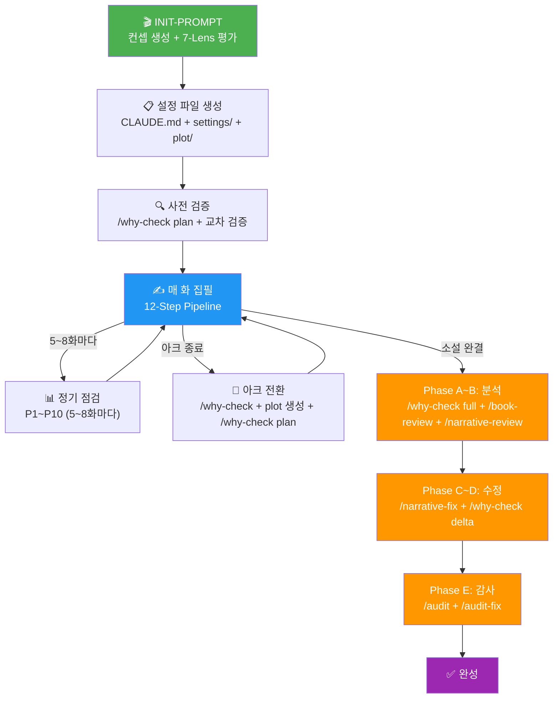
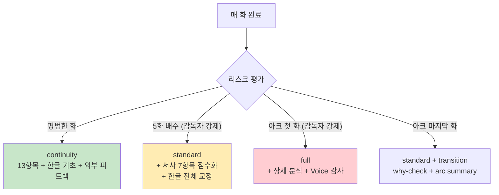

# Claude Novel Templates -- Lean Edition

AI(Claude Code)로 한국어 웹소설을 쓰기 위한 경량화 템플릿 시스템.

---

## 소개

이 시스템은 Claude Code를 집필 엔진으로 사용하여 한국어 웹소설을 처음부터 끝까지 작성하는 데 필요한 모든 것을 제공한다. 설정 파일, 에이전트, 커맨드, 워크플로가 하나의 템플릿으로 패키징되어 있어서, 복사 한 번으로 새 소설 프로젝트를 시작할 수 있다.

### 핵심 특징 5가지

1. **12-Step Writing Pipeline** -- 맥락 로딩부터 집필, 자가 리뷰, 요약 갱신, 커밋까지 매 화마다 12단계 파이프라인을 순서대로 수행한다. 단계를 건너뛸 수 없다.

2. **7-Lens Story Consultant** -- 소설 시작 전에 컨셉을 7가지 관점(연재 편집자, 장르 전문가, 캐릭터/감정 편집자, 구조 엔지니어, 설정 감사자, AI 실패 예측자, 주제/의미 편집자)에서 평가한다. GO/REVISE/NO-GO 판정이 나온 후에야 집필이 시작된다.

3. **Why-Checker & OAG (Obligatory Action Gap)** -- 집필 후 "독자가 왜?/어떻게? 라고 물을 지점"을 자동 탐지한다. Phase 1.5의 Generate-Then-Check 기법은 캐릭터가 정보를 알면서도 행동하지 않는 의무 행동 갭까지 잡아낸다. Planning Mode로 집필 전 플롯 검증도 가능하다.

4. **Voice Profile** -- `01-style-guide.md`의 Section 0에서 소설의 서술 온도, 보이스 우선순위, 대표 문단을 정의한다. 이것이 모든 에피소드의 서술 톤 앵커 역할을 한다.

5. **Thematic Management** -- `CLAUDE.md` Section 1.2에서 소설의 주 주제와 부 주제를 선언한다. 매 화의 Planning Gate(Step 4f)에서 주제적 기능을 명시하고, 정기 점검(P10)에서 주제 진전을 추적한다. 3화 이상 주제와 무관한 에피소드가 연속되면 경고한다.

### 원본 대비 변경점

| 항목 | 원본 (12-agent) | Lean (10-agent) |
|------|----------------|----------------|
| 집필 에이전트 | writer + reviewer + continuity-checker + korean-proofreader + gemini-feedback + summary-generator (6종) | **writer** + **unified-reviewer** (2종) |
| 감사/리뷰 에이전트 | full-audit + audit-verifier + audit-fixer (3종) | **full-audit** + **narrative-reviewer** + **narrative-fixer** + **book-reviewer** + **why-checker** (5종) |
| 셋업/검증 에이전트 | -- | **story-consultant** + **korean-naturalness** (2종) |
| 맥락 로딩 | 개별 summaries 파일 직접 읽기 | `compile_brief` MCP 1회 호출 (압축 브리프) |
| 요약 갱신 | summary-generator 에이전트 호출 | writer가 인라인 갱신 (별도 에이전트 불필요) |
| 리뷰 파이프라인 | reviewer -> gemini-feedback -> continuity-checker -> korean-proofreader (4단계) | review_episode MCP -> unified-reviewer (2단계) |
| 지시문 언어 | 한국어 | **영어** (토큰 ~40% 추가 절감). 소설 출력은 한국어 |
| 토큰 절감 | 기준 | **~70-80% 절감** |

### Language Contract

- **지시문** (CLAUDE.md, agents/, settings/): 영어로 작성 -- 토큰 절감
- **소설 출력** (본문, 대사, 요약, 리뷰): 반드시 **한국어**
- **한국어 예시** (문체, 호칭, 교정 규칙): 원문 그대로 보존 -- 스타일 타깃으로 기능

---

## 필수 환경

### Claude Code

이 시스템의 실행 엔진. 모든 에이전트와 커맨드는 Claude Code 안에서 실행된다.

**설치:**

```bash
npm install -g @anthropic-ai/claude-code
```

**권장 모델:** Opus 4.6 (1M context). 1M 컨텍스트가 핵심이다. full-audit, narrative-review, book-review 등 전체 소설을 한 번에 읽어야 하는 에이전트는 대용량 컨텍스트 없이는 청킹 모드로 품질이 떨어진다. Sonnet 계열도 집필은 가능하지만, 감사/리뷰 에이전트의 성능이 크게 저하된다.

**실행:**

```bash
cd my-novel && claude       # 대화형 (한 화씩 직접 집필)
cd my-novel && claude -p "1화 작성해줘"  # 비대화형 (배치 집필용)
```

### MCP 서버 4종

MCP(Model Context Protocol) 서버는 Claude Code에 도구를 제공한다. 소설 폴더의 `.claude/settings.local.json`에 MCP 서버 설정이 포함되어야 한다.

| MCP 서버 | 용도 | 필수 여부 | 설치 레포 |
|----------|------|----------|----------|
| **novel-editor** | 외부 AI 리뷰 + `compile_brief` 맥락 압축 + `review_episode` 외부 리뷰 호출 | **핵심 (강력 권장)** | [mcp-novel-editor](https://github.com/NA-DEGEN-GIRL/mcp-novel-editor) |
| **novel-calc** | 날짜/단위/이동시간/경제 계산. 타임라인 검증, 수치 연속성 확인 | 선택 (수치 중요한 소설에 권장) | [mcp-novel-calc](https://github.com/NA-DEGEN-GIRL/mcp-novel-calc) |
| **novel-hanja** | 한자어 검색/검증. 무협/사극/한자 병기 소설에 필수 | 선택 (한자 사용 소설에 필수) | [mcp-novel-hanja](https://github.com/NA-DEGEN-GIRL/mcp-novel-hanja) |
| **novelai-image** | 캐릭터/삽화/표지 이미지 생성 | 선택 | [mcp-novelai-image](https://github.com/NA-DEGEN-GIRL/mcp-novelai-image) |

**novel-editor 상세:**

`novel-editor`의 `compile_brief`가 lean 워크플로의 핵심이다. 프로젝트 파일(settings, summaries, plot 등 ~300KB+)을 압축하여 ~4-15KB 브리프로 만들어 준다. 없으면 개별 summaries 파일을 직접 읽는 폴백 모드로 동작하지만, 토큰 소비가 크게 증가한다.

**설치 방법 (공통):**

```bash
# 각 MCP 서버 레포를 클론하고 README의 설치 지침을 따른다.
git clone https://github.com/NA-DEGEN-GIRL/mcp-novel-editor.git
cd mcp-novel-editor
# README.md 참조하여 설치 및 Claude Code MCP 설정
```

### 외부 AI (선택)

이 시스템은 Claude 외에 다른 AI를 편집자/교정자로 활용할 수 있다. 모든 외부 AI 설정은 `CLAUDE.md` Section 1의 피드백 플래그로 제어한다. **모든 플래그가 false이면 외부 리뷰 없이 시스템이 정상 동작한다.**

#### Gemini CLI

연속성/세계관 검증에 강점이 있는 외부 편집자.

```bash
# 설치
npm install -g @google/gemini-cli

# CLAUDE.md에서 활성화
gemini_feedback: true
```

- **역할:** `review_episode` MCP 호출 시 자동으로 Gemini에게 연속성/세계관 리뷰를 요청한다
- **산출물:** `EDITOR_FEEDBACK_gemini.md`
- unified-reviewer가 standard/full 모드에서 이 파일을 참조하여 피드백을 반영한다

#### GPT (Codex CLI)

산문/대화/감정 표현 검증에 강점이 있는 외부 편집자.

```bash
# 설치
npm install -g @openai/codex

# CLAUDE.md에서 활성화
gpt_feedback: true
```

- **역할:** 산문 품질, 대화 자연스러움, 감정 표현 검증
- **산출물:** `EDITOR_FEEDBACK_gpt.md`

#### NIM (NVIDIA Inference Microservice)

맞춤법/문법 교정 전문. 로컬 또는 원격 NIM 프록시 서버가 필요하다.

```bash
# CLAUDE.md에서 활성화
nim_feedback: true
nim_feedback_model: "openai/gpt-oss-120b"   # 사용할 모델명
```

- **역할:** 맞춤법/문법 교정
- **산출물:** `EDITOR_FEEDBACK_nim.md`
- NIM 프록시 서버를 별도로 설정해야 한다 (`novel-editor`의 설정에서 NIM 엔드포인트를 지정)

#### Ollama

로컬 모델 기반 맞춤법/문법 교정. GPU가 있는 로컬 환경에서 사용.

```bash
# CLAUDE.md에서 활성화
ollama_feedback: true
ollama_feedback_model: "gpt-oss:120b"   # 사용할 모델명
```

- **역할:** NIM과 동일 (맞춤법/문법)
- **산출물:** `EDITOR_FEEDBACK_ollama.md`
- Ollama가 로컬에 설치되어 있고, 해당 모델이 다운로드되어 있어야 한다

#### 모든 외부 AI 비활성화

```yaml
# CLAUDE.md Section 1에서 모두 false로 설정
gemini_feedback: false
gpt_feedback: false
nim_feedback: false
ollama_feedback: false
```

이 상태에서도 시스템은 완전히 정상 동작한다. Claude 단독으로 집필, 리뷰, 감사를 모두 수행한다. 외부 AI는 "추가적인 시각"을 제공하는 것이지 필수가 아니다.

---

## 최소 경로: 외부 AI 없이 가장 빨리 시작하기

> 아래 4줄이면 소설을 쓰기 시작할 수 있다. MCP 서버와 외부 AI는 나중에 추가해도 된다.

```bash
git clone https://github.com/NA-DEGEN-GIRL/claude-novel-templates-lean.git
cp -r claude-novel-templates-lean my-novel
cd my-novel && claude
# → INIT-PROMPT.md의 프롬프트 1을 붙여넣기 (장르와 키워드 입력)
```

> **스모크 테스트** (셋업 후 확인):
> 1. `claude` 실행 → CLAUDE.md가 로드되는지 확인
> 2. "1화 작성해줘" → `chapters/` 안에 `chapter-01.md` 생성 확인
> 3. `summaries/running-context.md`가 갱신되었는지 확인

---

## 빠른 시작 (초보자용, 단계별 상세)

### Step 1: 템플릿 복사

```bash
# 1. 템플릿 클론
git clone https://github.com/NA-DEGEN-GIRL/claude-novel-templates-lean.git

# 2. 새 소설 폴더 생성
NEW_ID="my-novel"
mkdir -p $NEW_ID
cp -r claude-novel-templates-lean/{CLAUDE.md,INIT-PROMPT.md,MIGRATION-PROMPT.md,REBUILD-PROMPT.md,batch-supervisor.md,batch-supervisor-audit.md,settings,summaries,chapters,plot,reference,compile_brief.py} $NEW_ID/
mkdir -p $NEW_ID/.claude
cp -r claude-novel-templates-lean/.claude/* $NEW_ID/.claude/

# 3. 권한 설정 (배치 실행에 필수)
cp $NEW_ID/.claude/settings.local.example.json $NEW_ID/.claude/settings.local.json
```

`settings.local.json`은 `claude -p`(비대화형) 실행 시 MCP 도구 사용 권한을 자동 승인한다. 대화형(`claude`)에서는 수동 승인이 가능하므로 선택사항이지만, 배치 집필 시에는 반드시 필요하다.

### Step 2: 초기 셋업 (INIT-PROMPT)

`INIT-PROMPT.md`에 4가지 셋업 프롬프트가 준비되어 있다. 상황에 맞는 것을 선택한다.

| 프롬프트 | 용도 | 사용자 개입 정도 |
|---------|------|----------------|
| **프롬프트 1: 시나리오 선택형** (추천) | 장르/키워드를 주면 3개 시나리오를 제안. 선택 후 자동 셋업 | 중간 (시나리오 선택, 캐릭터 승인) |
| **프롬프트 2: 컨셉 확정형** | 이미 쓰고 싶은 소설이 정해져 있을 때. 바로 셋업 | 낮음 (컨셉 정보 제공 후 승인만) |
| **프롬프트 3: 풀 자동** | 장르만 던지면 모든 것을 자동 결정 | 최소 (장르만 지정) |
| **프롬프트 4: 기존 소설 복제** | 같은 설정으로 다른 AI/모델이 쓰게 할 때 (모델 비교 테스트용) | 낮음 |

**실행 예시 (프롬프트 1):**

```bash
cd /root/novel && claude
```

Claude Code 대화창에 INIT-PROMPT.md의 프롬프트 1을 복사하여 붙여넣는다. `[장르]`, `[톤앤무드]` 등의 대괄호 안을 실제 값으로 바꾼다.

**셋업 흐름 (프롬프트 1 기준):**

1. **1단계: 시나리오 제안** -- 장르/키워드 기반으로 3개 시나리오 생성. 각각 제목, 주인공, 핵심 갈등, 아크 구성, 차별점을 포함
2. **1.5단계: 전문가 컨셉 평가** -- story-consultant 에이전트가 7개 관점에서 각 시나리오를 GO/REVISE/NO-GO 판정
3. **2단계: 선택 & 확장** -- 사용자가 시나리오를 선택하면 캐릭터 3~5명, 아크별 플롯, 핵심 약속, 세계관 규칙을 설계
4. **2.5단계: 확장 컨셉 재평가** -- story-consultant가 확장된 컨셉을 재평가. GO가 나올 때까지 수정
5. **3단계: 프로젝트 생성** -- 템플릿 기반 전체 파일 자동 생성 (CLAUDE.md, settings, plot, summaries, agents, commands)
6. **3.5단계: 플롯 사전 검증** -- why-checker의 Planning Mode로 master-outline과 arc-01의 WHY/HOW/WHEN/SO-WHAT 검증. 구멍 발견 시 즉시 수정
7. **4단계: 교차 검증** -- 3팀(사실 관계/서사 실현성/표기 일관성)이 설정 파일 전체를 병렬 검증. 모순 발견 시 즉시 수정
8. **5단계: git commit** -- 소설 폴더 독립 레포 초기화 + 상위 레포에 등록

에피소드 집필은 셋업에서 수행하지 않는다. 설정 파일 생성과 검증까지만 수행한다.

### Step 3: 첫 화 집필

셋업이 완료되면 두 가지 방법으로 집필을 시작할 수 있다.

#### 방법 A: 직접 집필 (한 화씩)

```bash
cd /root/novel/my-novel && claude
# 대화창에서:
# "1화 작성해줘"
```

Claude가 `.claude/agents/writer.md`의 12-step 파이프라인을 따라 집필한다. compile_brief로 맥락을 로드하고, 비트시트를 작성하고, 본문을 쓰고, 자가 리뷰를 하고, 요약을 갱신하고, 커밋까지 한다.

**장점:** 매 단계를 확인하고 개입할 수 있다. 첫 소설이라면 이 방법을 추천한다.

#### 방법 B: 감독자 배치 집필 (자동 연속)

```bash
# 상위 폴더에서 감독자 실행
cd /root/novel && claude
# 대화창에서:
# "my-novel/batch-supervisor.md 대로 수행"
```

감독자(Claude Code)가 tmux 세션을 열고 집필 AI(별도 Claude Code 인스턴스)를 자동으로 관리한다. 에러 복구, 다음 화 전송, 아크 전환 시 why-check 실행까지 자동 처리한다.

**장점:** 무인 자동 집필. 밤새 돌려놓으면 아침에 여러 화가 완성되어 있다.
**주의:** batch-supervisor.md의 변수(NOVEL_ID, SESSION, ARC_MAP 등)를 먼저 채워야 한다.

### Step 4: 연속 집필

#### batch-supervisor.md 사용법

`batch-supervisor.md`는 감독자 프롬프트다. 실행 전에 다음 변수를 설정해야 한다:

| 변수 | 설명 | 예시 |
|------|------|------|
| `NOVEL_ID` | 소설 폴더명 | `no-title-015` |
| `SESSION` | tmux 세션명 | `write-015` |
| `NOVEL_DIR` | 소설 절대 경로 | `/root/novel/no-title-015` |
| `START_EP` | 시작 화 | `1` |
| `END_EP` | 종료 화 | `70` |
| `CHUNK_SIZE` | /clear 간격 (`-1` = auto-compact 사용, 권장) | `-1` |
| `WRITER_CMD` | 집필 AI 실행 명령 | `claude` |
| `ARC_MAP` | 아크-화수 매핑 | `{"arc-01": [1, 10], "arc-02": [11, 20]}` |

**CHUNK_SIZE 설정 가이드:**

- `-1` (권장): auto-compact를 사용한다. 1M 컨텍스트 모델(Opus)에서 권장. 맥락을 최대한 보존하면서 자동으로 관리한다.
- `10` 등 양수: 지정 화수마다 `/clear`로 컨텍스트를 리셋한다. auto-compact가 없는 모델이나 소형 컨텍스트 모델에서 사용.

#### tmux 설정

감독자가 tmux 세션을 자동으로 생성하고 관리한다. tmux가 설치되어 있어야 한다.

```bash
# tmux 설치 (Ubuntu/Debian)
sudo apt install tmux

# 감독자 실행
cd /root/novel && claude
# "my-novel/batch-supervisor.md 대로 수행"
```

#### 모니터링

감독자는 2분마다 tmux 화면을 캡처하여 상태를 판단한다:

- **Working**: 집필 중. 대기
- **Completed**: 완료. 다음 화 프롬프트 전송
- **Error**: 에러 분석 후 복구 명령 전송
- **Stuck**: 10분 이상 진행 없음. /clear 후 재시작
- **Permission request**: 자동으로 `y` 전송

진행 로그는 `summaries/batch-progress.log`에 기록된다.

---

## 프로젝트 구조 (상세)

```
my-novel/
├── CLAUDE.md                          <- Writing Constitution (소설의 최상위 규칙)
├── INIT-PROMPT.md                     <- 새 소설 셋업 프롬프트 (4종)
├── MIGRATION-PROMPT.md                <- 기존 12-agent -> lean 전환 (12단계)
├── REBUILD-PROMPT.md                  <- 소설 재구축 (세계관/플롯 재정립, 8 Phase)
├── batch-supervisor.md                <- 배치 집필 감독 프롬프트
├── batch-supervisor-audit.md          <- 배치 감사 감독 프롬프트
├── compile_brief.py                   <- compile_brief MCP 서버 코드
│
├── settings/                          <- 소설 설정 파일 (세계관, 캐릭터, 규칙)
│   ├── 01-style-guide.md              <- 문체 가이드 (Section 0: Voice Profile)
│   ├── 02-episode-structure.md        <- 에피소드 구조 (분량, 장면 수, 엔딩 훅)
│   ├── 03-characters.md               <- 캐릭터 시트 (성격, 말투, 대표 대사)
│   ├── 04-worldbuilding.md            <- 세계관 (규칙, 지리, 제도, 마법/기술 체계)
│   ├── 05-continuity.md               <- 연속성 설정 (타임라인, 기준일, 달력)
│   ├── 06-humor-guide.md              <- 유머 가이드 (선택, 장르에 따라)
│   ├── 07-periodic.md                 <- 정기 점검 설정 (P1~P10, 주기, Core/Optional)
│   └── 08-illustration.md             <- 표지/삽화 규칙
│
├── chapters/                          <- 에피소드 원고 (마크다운)
│   ├── prologue/                      <- 프롤로그 (있는 경우)
│   ├── arc-01/                        <- 1아크
│   │   ├── chapter-01.md
│   │   ├── chapter-02.md
│   │   └── ...
│   ├── arc-02/                        <- 2아크
│   └── ...
│
├── plot/                              <- 플롯 설계
│   ├── master-outline.md              <- 전체 아크 구성 (소설의 뼈대)
│   ├── foreshadowing.md               <- 복선 설계 (설치/회수 추적)
│   ├── arc-01.md                      <- 1아크 상세 플롯
│   ├── arc-02.md                      <- 2아크 상세 플롯
│   └── ...
│
├── summaries/                         <- 요약/추적 파일 (writer가 매 화 갱신)
│   ├── running-context.md             <- 현재 상태 압축 (최근 5~6화 상세 + 전체 흐름)
│   ├── episode-log.md                 <- 에피소드별 요약 (전 화수)
│   ├── character-tracker.md           <- 캐릭터 현재 상태 (위치, 부상, 감정)
│   ├── promise-tracker.md             <- 약속/서약 추적
│   ├── knowledge-map.md               <- 캐릭터별 정보 보유 현황
│   ├── relationship-log.md            <- 관계 변화 이력
│   ├── decision-log.md                <- 프로젝트 단위 의도적 규칙 이탈 기록
│   ├── editor-feedback-log.md         <- 외부 AI 피드백 처리 이력
│   ├── explained-concepts.md          <- 세계관 용어 설명 추적
│   ├── hanja-glossary.md              <- 한자 병기 용어집
│   ├── illustration-log.md            <- 삽화 생성 이력
│   ├── batch-progress.log             <- 배치 집필 진행 로그
│   ├── why-check-report.md            <- why-checker 보고서
│   ├── why-check-plan-*.md            <- 플롯 사전 검증 보고서
│   ├── book-review.md                 <- Claude 독자 평가
│   ├── book-review-gpt.md             <- GPT 독자 평가
│   ├── narrative-review-report.md     <- 서사 품질 리뷰 보고서
│   ├── narrative-fix-log.md           <- 서사 수정 이력
│   ├── why-fix-log.md                 <- why-check 기반 수정 이력
│   ├── full-audit-report.md           <- 전수 감사 보고서
│   └── final-review-state.md          <- 최종 검증 진행 상태
│
├── reference/                         <- 참고 자료
│   └── name-table.md                  <- 이름 레퍼런스 (~590항목, 12개 문화권)
│
├── EDITOR_FEEDBACK_gemini.md          <- Gemini 리뷰 결과 (자동 생성)
├── EDITOR_FEEDBACK_gpt.md             <- GPT 리뷰 결과 (자동 생성)
├── EDITOR_FEEDBACK_nim.md             <- NIM 리뷰 결과 (자동 생성)
├── EDITOR_FEEDBACK_ollama.md          <- Ollama 리뷰 결과 (자동 생성)
│
└── .claude/                           <- Claude Code 설정
    ├── settings.local.example.json    <- MCP 권한 설정 템플릿
    ├── settings.local.json            <- MCP 권한 설정 (example에서 복사)
    ├── agents/                        <- 에이전트 9종
    │   ├── writer.md
    │   ├── unified-reviewer.md
    │   ├── story-consultant.md
    │   ├── full-audit.md
    │   ├── narrative-reviewer.md
    │   ├── narrative-fixer.md
    │   ├── book-reviewer.md
    │   ├── why-checker.md
    │   └── korean-naturalness.md
    └── commands/                      <- 커맨드 10종
        ├── audit.md
        ├── audit-fix.md
        ├── narrative-review.md
        ├── narrative-fix.md
        ├── book-review.md
        ├── book-review-gpt.md
        ├── naturalness.md
        ├── naturalness-fix.md
        ├── why-check.md
        └── final-review.md
```

---

## 핵심 개념

### Writing Constitution (CLAUDE.md)

`CLAUDE.md`는 소설의 최상위 규칙 문서다. 모든 에이전트와 커맨드는 이 파일을 먼저 읽고 따른다.

| 섹션 | 내용 |
|------|------|
| **Section 1: Project Overview** | 제목, 장르, 톤, 한줄 소개, 외부 AI 피드백 플래그, Core Promises |
| **Section 1.1: Core Promises** | 이 소설이 반드시 지키는 3가지 약속 (예: "주인공은 끝까지 능동적이다") |
| **Section 1.2: Thematic Statement** | 주 주제 + 부 주제. 소설의 영혼. 매 화가 이 주제와 연결되어야 한다 |
| **Section 2: Folder Structure** | 프로젝트 디렉토리 구조 |
| **Section 3: Writing Workflow** | 집필 워크플로 (Prep -> Write -> Review -> Post-Processing) |
| **Section 4: File Reference Priority** | CLAUDE.md > settings/ > 에피소드 텍스트 > summaries/ |
| **Section 5: Prohibitions** | 11가지 금지 사항 (갑작스러운 성격 변화, 데우스 엑스 마키나 등) |
| **Section 5.1: Intentional Mysteries** | 의도적 비밀 테이블. why-check가 이 항목은 "설명 누락"이 아니라 의도적 미스터리로 간주 |
| **Section 6: Episode Metadata** | EPISODE_META 형식 (에피소드 끝에 붙는 메타데이터) |
| **Section 7: Cover & Illustrations** | 표지/삽화 규칙 |
| **Section 8: Dialogue Rules** | 호칭/어투 매트릭스, 상황별 어투 전환, 변화 이력 |
| **Section 9: Customization Guide** | 템플릿 커스터마이징 가이드 |

**Thematic Statement (Section 1.2) 상세:**

주 주제는 소설 전체를 관통하는 핵심 질문이다. 예를 들어 "상실 후에도 사랑할 수 있는가", "정의는 복수와 어떻게 다른가" 같은 것이다. 부 주제는 아크별로 다를 수 있는 변주다.

매 화의 Planning Gate(writer.md Step 4f)에서 "이번 화는 [주제]를 [방식]으로 진전시킨다"를 작성한다. 3화 이상 주제와 무관한 에피소드가 연속되면 정기 점검(P10)에서 경고가 발생한다.

**Intentional Mysteries (Section 5.1) 상세:**

why-checker는 "독자가 모르는 것"을 탐지한다. 하지만 의도적으로 숨기는 비밀도 있다. 이 테이블에 등록된 항목은 why-check 실행 시 자동으로 건너뛴다.

```markdown
| 비밀 | 공개 예정 시점 | 왜 숨기는가 |
|------|-------------|-----------|
| 주인공의 진짜 정체 | arc-03 | 반전의 핵심 |
```

이 목록에 없는 설명 누락은 실수로 간주한다.

### Voice Profile (01-style-guide.md Section 0)

소설의 서술 톤을 정의하는 앵커. 3가지 요소로 구성된다:

1. **서술 온도 (Section 0.1)**: 서술자가 사건을 전달할 때의 기본 거리감/태도. 한 문장으로 선언한다.
   - 예: "건조하고 관찰적이다. 감정을 명명하지 않고, 행동과 침묵으로 드러낸다."
   - 예: "따뜻하지만 한 발 떨어져 있다. 인물을 애정하되 판단하지 않는다."

2. **보이스 우선순위 (Section 0.2)**: 문체 규칙이 충돌할 때 무엇을 먼저 살리는가. 3가지를 순위대로.
   - 예: 1. 감정 절제 2. 속도감 3. 비유 회피

3. **대표 문단 (Section 0.3)**: 소설의 서술 목소리를 가장 잘 보여주는 지문 문단 2~3종. 서로 다른 장면 유형(긴장 vs 일상, 액션 vs 내면)을 커버해야 한다. 첫 아크에서는 `[provisional]` 태그를 붙이고, 아크 완료 후 실제 에피소드에서 교체한다.

### 12-Step Writing Pipeline

writer 에이전트가 매 화마다 수행하는 12단계 파이프라인:

| 단계 | 이름 | 내용 |
|------|------|------|
| **A. Prep** | | |
| 1 | compile_brief | MCP로 맥락 압축 브리프 로드 (~4-15KB) |
| 2 | Arc alignment | 현재 아크 플롯 확인. 이번 화의 역할과 다음 2~3화 런웨이 |
| 3 | Previous episode | 직전 화 마지막 2~3문단 확인. 훅 연결 + 훅 중복 방지 |
| **B. Planning** | | |
| 4 | Planning gate | 비트시트 작성 (2~4장면). Planning flags 설정. 주제적 기능 명시 |
| 5 | Reader objection preflight | 독자 WHY/HOW 질문 3개. 답변됨/미스터리 유예/답 없음 분류 |
| **C. Writing** | | |
| 6 | First draft | 목표 분량 내에서 본문 집필 |
| 7 | Self-review | 7가지 기본 + 4가지 조건부 항목 자가 리뷰 |
| **D. Summary** | | |
| 8 | Inline summary update | running-context, episode-log, character-tracker 등 7종 요약 갱신 |
| 9 | Summary fact-check | 갱신된 요약이 실제 에피소드와 일치하는지 검증 |
| **E. Review** | | |
| 10 | External review + Unified review | 매 화 외부 AI 리뷰(review_episode) 호출 → unified-reviewer 실행 (모드: review_floor 기반) |
| **F. Finalize** | | |
| 11 | EPISODE_META | 메타데이터 삽입 (review_mode/review_floor/external_review 포함) |
| 12 | Git commit | 원고 + 요약 커밋 |

**Planning Flags 시스템 (Step 4):**

집필 전에 4가지 플래그를 설정한다. 이 플래그에 따라 Step 7의 자가 리뷰 항목이 달라진다:

| 플래그 | 의미 | 활성화 시 추가 리뷰 |
|--------|------|-------------------|
| `flashback_present` | 이번 화에 회상/과거 장면 | 회상 내용이 설정과 일치하는지 검증 |
| `new_danger` | 캐릭터가 새 위험/적 정보 습득 | 의무 행동 검사 (알면서 왜 안 하나) |
| `new_setting_claim` | 세계관 규칙 도입/의존 | 기존 worldbuilding과 모순 없는지 |
| `calc_used` | novel-calc 수치 검증 사용 | 캐릭터 대사에 정밀 수치가 새어나오지 않았는지 |

확실하지 않으면 `yes`로 설정한다. 오탐(false positive)이 미탐(false negative)보다 낫다.

**Risk Escalation (Review Mode):**

| 모드 | 트리거 | 범위 |
|------|--------|------|
| `continuity` (기본) | 매 화 | 연속성 13항목 + 한글 기초 + **외부 AI 피드백 전체 처리** |
| `standard` (5화 배수, 감독자 강제) | 5화 배수 또는 고위험 화 | continuity + **서사 품질 7항목 점수화** + 한글 전체 교정 + summary 검증 |
| `full` (아크 첫 화, 감독자 강제) | 아크 첫 화 또는 설정 변경 | 전 항목 + 상세 분석 + Voice Profile 감사 + settings/ 직접 참조 |
| `standard + arc transition` (아크 마지막 화) | 아크 마지막 화 | standard 리뷰 + why-check text + narrative-fix + arc summary + thread triage |

> **외부 AI 리뷰(review_episode MCP)는 모든 화에서 호출된다.** unified-reviewer 모드와 무관. 실패 시 로그만 남기고 계속.
> **review_floor**: 감독자가 에피소드 번호로 결정 (5화배수=standard, 아크경계=full). writer는 floor 이상으로만 승격 가능.

### Why-Checker & OAG

why-checker는 "독자가 왜?/어떻게?라고 물을 지점"을 탐지하는 에이전트다.

**Phase 1: Question Generation** -- 에피소드를 순서대로 읽으면서 WHY/HOW/WHEN/SO-WHAT 질문을 생성한다. 이 단계에서는 답을 찾지 않는다 (오염 방지).

**Phase 1.5: OAG (Obligatory Action Gap)** -- Generate-Then-Check 기법의 핵심:

1. 각 POV 캐릭터의 "상태 스냅샷"을 생성 (성격, 알고 있는 것, 원하는 것, 제약)
2. 그 캐릭터가 **당연히 할 행동**을 생성 (생성 시 답을 찾지 않음)
3. 실제 텍스트에서 그 행동이 있는지 검색
4. ABSENT(없음)이면 "왜 이 캐릭터는 알면서도 행동하지 않았는가?" 질문으로 변환

이 기법이 잡아내는 것: 캐릭터가 위험을 알면서 경고하지 않는 경우, 증거를 발견하고도 조사하지 않는 경우, 사랑하는 사람이 위험한데 보호하지 않는 경우 등.

**Phase 2: Answer Audit** -- 질문 목록을 들고 텍스트를 재탐색. ANSWERED/INFERABLE/MISSING으로 분류.

**Phase 3: Priority Scoring** -- Reader Impact x (4 - Fix Cost) = Priority. 6점 이상은 출판 전 수정 필요.

**Planning Mode** (`/why-check plan`): 집필 전에 플롯 파일에 적용. 플롯 단계에서 구멍 1개를 막는 비용은 문장 1개다. 같은 구멍이 집필 후 발견되면 장면 재작성이 필요하다.

### Desire Engine & Reader Engagement

`01-style-guide.md` Section 8에 정의된 독자 참여 시스템:

- **정보 공개 속도**: 즉시 공개(이해에 필수) vs 유보(나중에 공개하면 더 강력한 정보)
- **에피소드 욕망**: 매 화에서 시점 캐릭터가 "무엇을 원하는가"와 "무엇이 막는가"가 명확해야 한다
- **감정 부채**: 감정 클라이맥스는 독자가 그 관계에 충분히 투자한 후에만 효과적이다
- **Desire Engine**: 독자가 지금 가장 원하는 것을 의식하고, 지연/좌절/부분 충족으로 긴장을 유지한다. 하나의 갈망이 충족될 때 새로운 갈망이 열려야 한다.

---

## 에이전트 9종 (상세)

### 1. writer

매 화 집필을 담당하는 핵심 에이전트. 12-step 파이프라인을 순서대로 수행한다.

- **실행 시점:** 매 화
- **입력:** compile_brief 브리프 + 아크 플롯 + 직전 화 마지막 문단
- **산출물:** 에피소드 마크다운 + 갱신된 summaries 7종 + EPISODE_META
- **특징:**
  - Planning flags 기반 조건부 자가 리뷰 (Step 7)
  - 요약 갱신을 writer가 직접 수행 (별도 에이전트 불필요)
  - 엔딩 훅 5유형 순환 관리 (위기/반전/질문/결심/재회)
  - 한자어는 `novel-hanja` MCP로 검증 (LLM 추론 금지)
  - 수치는 `novel-calc`로 검증하되, 캐릭터 대사에 정밀값 삽입 금지

### 2. unified-reviewer

연속성 + 서사 품질 + 한글 교정 + 외부 피드백을 단일 패스로 처리한다.

- **실행 시점:** 매 화 (writer가 Step 10에서 호출)
- **입력:** compile_brief 브리프 + 에피소드 텍스트 + 직전 에피소드 + EDITOR_FEEDBACK 파일
- **산출물:** 인라인 리뷰 (별도 파일 없음)
- **3가지 모드:**
  - `continuity`: 연속성 13항목 + 한글 치명적 오류. 가볍고 빠름
  - `standard`: continuity + 서사 품질 7항목 + 한글 전체 교정 + 외부 피드백. AI 심리 위반 패턴(P1~P10) 중 발견된 것만 보고
  - `full`: 전 항목 + 상세 분석 + settings/ 직접 참조. AI 패턴 전수 감사. Voice Profile 점검
- **특징:**
  - 외부 AI 소스별 전문 영역 구분 (Gemini: 연속성, GPT: 산문, NIM/Ollama: 맞춤법)
  - Summary 검증(S1~S6) 내장
  - 병렬 집필 시 교차 검증(C1~C7) 지원

### 3. story-consultant

소설 시작 전 컨셉을 평가하는 사전 검증 에이전트. 집필 후 리뷰어가 아니다.

- **실행 시점:** INIT-PROMPT Step 1 (시나리오 평가) + Step 2.5 (확장 컨셉 재평가)
- **입력:** 시나리오/컨셉 정보
- **산출물:** 인라인 평가 (대화 중 출력)
- **7개 관점(Lens):**
  1. 연재 편집자 -- 웹소설 상품성, 에피소드 엔진, 지속 가능성, Desire Engine
  2. 장르 전문가 -- 장르 독자 만족도, 장르 쾌감 밀도
  3. 캐릭터/감정 편집자 -- 주인공 매력, 관계 엔진, 능동성 유지
  4. 구조 엔지니어 -- 반복 루프, 갈등 층위, 처짐 구간 예측
  5. 설정/연속성 감사자 -- 미정의 시스템, 명명 규칙, 비용 체계
  6. AI 집필 실패 예측자 -- 주인공 수동화, 스케일 인플레이션, 클라이맥스 압축
  7. 주제/의미 편집자 -- 주제-컨셉 정합성, 아크별 주제 변주
- **판정:** GO / REVISE / NO-GO. 어떤 관점이든 3점 미만이면 REVISE

### 4. full-audit

전수 팩트 체크. 소설 전체를 읽고 연속성/품질/한글 오류를 보고한다. 1M 컨텍스트 최적화.

- **실행 시점:** 아크 완결 또는 소설 완결 시 (`/audit` 커맨드)
- **입력:** settings 전체 + summaries(교차 검증용) + 에피소드 전체
- **산출물:** `summaries/full-audit-report.md`
- **읽기 전용:** 에피소드를 절대 수정하지 않는다
- **특징:**
  - 용량 자동 판단: 750K자 이하 -> 싱글 패스, 초과 -> 아크별 청킹
  - Phase 2.5: korean-naturalness를 에피소드별 개별 Agent로 호출 (주의력 유지)
  - Phase 3: 소설 전체 패턴 분석 (반복 문제 Top 5, 고유명사 불일치, 미회수 복선, 캐릭터 보이스 드리프트 등 10가지)
  - Phase 5: 자체 검증 (오류 확인 + 경계/집계 무결성)

### 5. narrative-reviewer

서사 품질 전체 리뷰. "이야기가 아직 좋은가?"에 답한다. 팩트 체크가 아닌 예술적 품질 평가.

- **실행 시점:** 아크/소설 완결 시 (`/narrative-review` 커맨드)
- **입력:** settings(일부) + 에피소드 전체
- **산출물:** `summaries/narrative-review-report.md` (수정 가이드 포함)
- **읽기 전용:** 수정은 narrative-fixer가 담당
- **10 Pillars:**
  1. 장르/톤 일관성
  2. 주인공 능동성 (능동적 선택 vs 수동적 수용 비율)
  3. 스케일/친밀감 균형 (스케일 인플레이션 감지)
  4. 플롯 장치 건강도 (데우스 엑스 마키나, 편의 클러스터링)
  5. 감정 공명 (얻어진/매몰된/서두른 감정)
  6. 산문 패턴 분석 (반복 표현, 감각 편향, AI 전환어)
  7. 인과/목표 명확성
  8. 페이싱/장면 효용
  9. 아크별 품질 곡선
  10. 주제 일관성
- **Phase 1.5:** WTF 테스트 + 가장 큰 구조 문제 1개
- **Phase 2.5:** 최종 아크 정합성 5가지 테스트 (복선, 규칙, 스케일 연결, 약속 vs 실행, 캐릭터 일관성)
- **Phase 4:** 교차 검증 -- book-review, book-review-gpt, why-check-report가 존재하면 읽고 텍스트에서 재진단하여 fix guide에 통합. 외부 판단을 그대로 수용하지 않음

### 6. narrative-fixer

서사 리뷰 기반 수술적 수정. 작가가 아니라 외과의사. 최소 변경으로 진단된 문제를 해결한다.

- **실행 시점:** narrative-review 또는 why-check 후 (`/narrative-fix` 커맨드)
- **입력:** narrative-review-report.md + 대상 에피소드 + settings
- **산출물:** 수정된 에피소드 + `summaries/narrative-fix-log.md`
- **6가지 기본 전략 (S1~S6):**
  - S1: 정보 덤프 해소 (보고서 읽기 -> 행동을 통한 발견으로)
  - S2: 주인공 능동성 복원 (지시받음 -> 스스로 판단/선택)
  - S3: 감정 장면 복원 (기술 콘텐츠에 매몰된 감정 구출)
  - S4: 복선 삽입 (뜬금없는 반전에 사전 씨앗 심기)
  - S5: 반복 패턴 교정 (~60-70% 감소, 100% 아님)
  - S6: 페이싱 재조정 (늘어진 부분 압축, 압축된 부분 확장)
- **WHY-CHECK 모드 (E1~E4):** `--source why-check`로 호출. 항목당 1~3문장, 단일 화수, 기존 장면 내부 삽입만. 한도 초과 시 HOLD 처리

### 7. book-reviewer

독자/비평가 관점 순수 평가. settings, plot, summaries를 읽지 않는다. 본문만으로 판단한다.

- **실행 시점:** 아크/소설 완결 시 (`/book-review` 커맨드)
- **입력:** 에피소드 전체 (본문만)
- **산출물:** `summaries/book-review.md` (추천 카드 + 12섹션 평가)
- **읽기 전용, 수정 제안 없음**
- **특징:**
  - Phase 1.5: 분석 전 직관적 독후감 (걸린 순간, 빨라진 순간, 느려진 순간, 신뢰 깨진 지점)
  - 추천 카드: 한줄 소개, 점수, 추천/비추, 한마디 (웹 리더가 파싱하여 표시)
  - 비교 작품 제시 (한국/해외 문학, 웹툰, 애니 등)
  - 스포일러 규칙: 독자 대면 섹션은 스포일러 금지, 작가 대면 섹션은 OK

### 8. why-checker

설명 누락 탐지. "텍스트에 없으면 독자도 모른다"는 원칙.

- **실행 시점:** 아크 전환, 소설 완결, 플롯 사전 검증, 롤링 미니체크
- **입력:** 에피소드 텍스트만 (summaries/settings 읽지 않음, 5.1 Intentional Mysteries만 예외)
- **산출물:** `summaries/why-check-report.md`
- **읽기 전용**
- **모드:** `/why-check arc-XX`, `/why-check N-M`, `/why-check full`, `/why-check plan`
- 상세는 위 "Why-Checker & OAG" 섹션 참조

### 9. korean-naturalness

한국어 자연스러움 전수 검사. 문법이 맞더라도 원어민 감각에 어색하면 지적한다.

- **실행 시점:** 완결 후 품질 점검 또는 `/naturalness` 커맨드
- **입력:** 에피소드 텍스트 (1화씩 개별 Agent)
- **산출물:** 인라인 보고서
- **특징:**
  - "느낌상 이상하다"가 유효한 근거. 오탐을 두려워하지 않는다
  - 의도적 문체 여부는 판단하지 않음 -- `/naturalness-fix`가 맥락을 보고 결정
  - 에피소드별 개별 Agent 호출 필수 (연속 처리 시 주의력 급감)

---

## 커맨드 10종 (상세)

Claude Code 대화창에서 `/커맨드명`으로 실행한다.

### /audit

전수 감사 실행. 소설 전체를 읽고 연속성/품질/한글 오류를 보고한다.

- **사용법:** `/audit` (전체) | `/audit N-M` (범위)
- **에이전트:** full-audit
- **산출물:** `summaries/full-audit-report.md`
- **읽기 전용.** 에피소드를 수정하지 않는다.
- **소요 시간:** 소설 길이에 따라 30분~2시간

### /audit-fix

감사 보고서 기반 오류 수정. 연속성 -> 품질 -> 한글 순서로 수정한다.

- **사용법:** `/audit-fix`
- **전제:** `full-audit-report.md` 존재
- **산출물:** `summaries/full-audit-fix-log.md` + 수정된 에피소드

### /narrative-review

서사 품질 리뷰. 10 Pillars 분석 + Phase 4 교차 검증.

- **사용법:** `/narrative-review`
- **에이전트:** narrative-reviewer
- **산출물:** `summaries/narrative-review-report.md`
- **읽기 전용.** 수정은 `/narrative-fix`로.
- **Phase 4:** book-review, book-review-gpt, why-check-report가 존재하면 자동으로 교차 검증

### /narrative-fix

서사 리뷰 기반 수정. 기본 모드(S1~S6)와 WHY-CHECK 모드(E1~E4).

- **사용법:**
  - `/narrative-fix` -- narrative-review 기반 구조적 수정
  - `/narrative-fix --source why-check` -- why-check 기반 경량 패치 (1~3문장)
  - `/narrative-fix --source why-check --scope priority-6+` -- 우선도 6+ 항목만
- **전제:** 해당 보고서 파일 존재
- **산출물:** `summaries/narrative-fix-log.md` 또는 `summaries/why-fix-log.md`
- **사용자 승인 후 실행.** 수정 계획을 먼저 보여준다.

### /book-review

Claude가 독자/비평가 관점으로 작품을 평가한다. 본문만 읽고 판단.

- **사용법:** `/book-review`
- **에이전트:** book-reviewer
- **산출물:** `summaries/book-review.md`
- **수정 제안 없음.** 순수 평가만.

### /book-review-gpt

GPT로 독자 관점 리뷰. Claude와 다른 시각을 제공한다. 두 리뷰를 비교하면 균형 잡힌 평가가 가능하다.

- **사용법:** `/book-review-gpt`
- **전제:** GPT MCP 설정 필요
- **산출물:** `summaries/book-review-gpt.md`

### /naturalness

한국어 자연스러움 전수 검사. 에피소드별 개별 Agent 호출.

- **사용법:** `/naturalness`
- **에이전트:** korean-naturalness (에피소드당 1개)
- **산출물:** 인라인 보고서 (에피소드별)

### /naturalness-fix

naturalness 보고서의 지적 사항을 맥락 기반 선별 수정. 의도적 문체/말투 오탐을 필터링한다.

- **사용법:** `/naturalness-fix`
- **산출물:** 수정된 에피소드

### /why-check

WHY/HOW 질문 생성 + 본문 답 검색. 여러 모드 지원.

- **사용법:**
  - `/why-check arc-XX` -- 특정 아크 검증
  - `/why-check N-M` -- 범위 검증
  - `/why-check full` -- 전체 검증
  - `/why-check plan` -- 플롯 파일 사전 검증 (Planning Mode)
- **에이전트:** why-checker
- **산출물:** `summaries/why-check-report.md` 또는 `summaries/why-check-plan-*.md`

### /final-review

완결 후 최종 검증 파이프라인. 3단계 순차 실행.

- **사용법:**
  - `/final-review` -- 현재 상태 확인 + 다음 단계 안내
  - `/final-review analyze` -- Phase A~B: why-check full + book-review 2종 + narrative-review (~2시간)
  - `/final-review fix` -- Phase C~D: narrative-fix + why-check delta + why-fix (~1시간, 사용자 승인 필요)
  - `/final-review audit` -- Phase E: audit + audit-fix (~1시간)
- **상태 파일:** `summaries/final-review-state.md`로 진행 추적. 세션이 끊겨도 재개 가능
- **순서 필수:** analyze -> fix -> audit. 이전 Phase 미완료 시 다음 Phase 실행 거부

---

## 워크플로

### 전체 소설 라이프사이클



### 매 화 12-Step Pipeline


### Risk Escalation (리뷰 모드 결정)



### 매 화 (12-Step Pipeline) — 텍스트 버전

```
A. Prep --- compile_brief MCP (압축 브리프 ~4-15KB)
     |
B. Plan --- 비트시트 (2~4 장면) + planning flags + 주제적 기능
     |
C. Write -- 본문 집필 (문체 + 세계관 준수) + 자가 리뷰
     |
D. Summary - writer가 직접 요약 7종 갱신 + fact-check
     |
E. Review
   |-- review_episode MCP (매 화 호출) -> EDITOR_FEEDBACK_*.md
   |-- unified-reviewer (review_floor 기반: continuity/standard/full)
   +-- korean-naturalness (최종 패스)
     |
F. Finalize - EPISODE_META 삽입 + git commit
```

### 주기적 점검 (P1~P10)

5화 단위 기본, 최대 8화까지 유연. 아크 전환 시 강제 트리거.

**Core (매 점검 시 필수):**

| # | 항목 | 방법 |
|---|------|------|
| P1 | 요약 정합성 | unified-reviewer standard 모드 S1-S6 |
| P3 | 캐릭터 상태 최신성 | character-tracker 최신 에피소드 대조 |
| P6 | 성격 드리프트 | 최근 대사/행동이 캐릭터 시트와 일치하는지 |
| P9 | 메타 참조 금지 | "X화에서" 전수 검사 |
| P10 | 주제 진전 | EPISODE_META thematic_function 추적 |

**Optional (해당 시에만):**

| # | 항목 | 방법 |
|---|------|------|
| P2 | 복선 회수 시한 | foreshadowing.md 만기 체크 |
| P4 | 미이행 약속 | promise-tracker 체크 |
| P5 | running-context | 200줄 이내 + 최신 반영 |
| P7 | 외부 AI 일괄 리뷰 | `batch_review` MCP |
| P8 | 한글 품질 | P7에서 수정된 에피소드만 |

### 아크 전환

아크 전환 시 자동 실행 (arc transition package):

1. `/oag-check` — 행동 갭 탐지 (별도 에이전트)
2. `/narrative-fix --source oag` — 행동 갭 수정 (CRITICAL→HIGH)
3. `/why-check text` — **수정된 본문**에서 설명 누락 탐지
4. `/narrative-fix --source why-check --scope priority-6+` — 설명 보강
5. Arc summary + character state reset + thread triage
6. 다음 아크 plot 파일 없으면 생성
7. `/why-check plan` — 다음 아크 플롯 사전 검증
8. 정기 점검(P1~P10) 지시

> oag 수정 → why-check 순서가 중요. oag가 장면 골격을 바꾸므로, why-check는 수정된 최신 본문 기준으로 돌려야 한다.

### 완결 후 최종 검증 (/final-review)

```
Phase A~B: /final-review analyze
  (1) /why-check full               -- 전체 설명 누락 탐지
  (2) /book-review + /book-review-gpt  -- 독자 평가 2종 (병렬)
  (3) /narrative-review              -- 서사 품질 분석 (Phase 4: (1)(2) 참조)

Phase C~D: /final-review fix
  (4) /narrative-fix                 -- S1~S6 구조적 수정
  (5) /why-check delta               -- 수정된 화수만 재검증
  (6) /narrative-fix --source why-check -- still-missing만 경량 패치

Phase E: /final-review audit
  (7) /audit                         -- 팩트 검증 + 한글 교정 (Phase 2.5 자연스러움 내장)
  (8) /audit-fix                     -- 필요 시 오류 수정
```

각 단계는 독립 세션에서 실행 가능하다 (`final-review-state.md`로 재개).

---

## 프롬프트 파일 4종

### [INIT-PROMPT.md](./INIT-PROMPT.md)

새 소설 프로젝트를 생성하는 프롬프트 모음. 4가지 변형이 준비되어 있다.

- **프롬프트 1 (시나리오 선택형):** 가장 포괄적. 시나리오 제안 → 7-Lens 평가 → 선택 → 확장 → 재평가 → 파일 생성 → 플롯 검증 → 교차 검증 → 커밋. 총 8단계.
- **프롬프트 2 (컨셉 확정형):** 이미 아이디어가 있을 때. 평가 + 파일 생성 + 검증.
- **프롬프트 3 (풀 자동):** 장르만 지정. Claude가 모든 것을 결정.
- **프롬프트 4 (복제):** 기존 소설의 설정을 복제하여 새 프로젝트 생성. 모델 비교 테스트용.

모든 프롬프트는 `/root/novel/`(상위 폴더)에서 실행한다. 소설 폴더 안이 아니다.

### [MIGRATION-PROMPT.md](./MIGRATION-PROMPT.md)

기존 12-agent 소설 프로젝트를 lean 9-agent 체계로 전환하는 12단계 마이그레이션 프롬프트.

- **사전 백업** → **인벤토리** → **계획 수립** → **lean 골격 반영** → **CLAUDE.md 재구성** → **settings 영어 전환** → **참조 교체** → **summaries 스키마** → **운영 문서** → **정적 검증** → **GPT 의미 검증** → **agent 작동 검증** → **커밋**
- 본문(`chapters/`)은 절대 수정하지 않는다
- 진행 중인 소설과 완결 소설 모두 지원

### [REBUILD-PROMPT.md](./REBUILD-PROMPT.md)

lean 마이그레이션 후 세계관/플롯을 재정립하고 처음부터 다시 집필할 수 있도록 준비하는 8 Phase 프롬프트.

- **사용 시점:** 초기 세팅이 검증 없이 만들어져서 설정 구멍이 많은 경우, 기존 집필 품질이 목표에 미달하는 경우
- 기존 원고는 아카이브(보존)하고 삭제하지 않는다
- 핵심 컨셉은 유지하고 실행 방법만 개선한다

### [batch-supervisor.md](./batch-supervisor.md)

배치 자동 집필 감독 프롬프트. 감독자(Claude Code)가 tmux 세션의 집필 AI를 모니터링한다.

- 에러 복구, 질문 응답, 다음 화 전송을 자동 처리
- 아크 전환 시 why-check + plot 생성 + why-check plan 자동 수행
- 정기 점검 타이밍 자동 감지 및 지시
- 소설 완결 시 전체 검증 파이프라인(Phase A~E) 자동 실행
- 감독자 컨텍스트 부족 시 Self-Replacement Prompt 출력

---

## 외부 AI 리뷰 설정 상세

### Gemini 설정

```yaml
# CLAUDE.md Section 1
gemini_feedback: true
```

- **설치:** `npm install -g @google/gemini-cli`
- **역할:** 연속성/세계관 검증에 특화
- **동작:** writer Step 10에서 standard/full 모드일 때 `review_episode` MCP가 자동 호출. Gemini에게 에피소드를 보내고 리뷰를 받는다
- **산출물:** `EDITOR_FEEDBACK_gemini.md`
- **unified-reviewer에서의 처리:** [Continuity], [Setting] 태그 항목을 적극 반영

### GPT 설정

```yaml
# CLAUDE.md Section 1
gpt_feedback: true
```

- **설치:** `npm install -g @openai/codex`
- **역할:** 산문/대화/감정 표현 검증에 특화
- **동작:** Gemini와 동일한 경로로 호출
- **산출물:** `EDITOR_FEEDBACK_gpt.md`
- **unified-reviewer에서의 처리:** [Prose], [Dialogue], [Emotion] 태그 항목을 적극 반영

### NIM 설정

```yaml
# CLAUDE.md Section 1
nim_feedback: true
nim_feedback_model: "openai/gpt-oss-120b"
```

- **전제:** NIM 프록시 서버가 실행 중이어야 한다 (novel-editor의 설정에서 엔드포인트 지정)
- **역할:** 맞춤법/문법 교정 전문
- **산출물:** `EDITOR_FEEDBACK_nim.md`
- **unified-reviewer에서의 처리:** Gemini가 놓친 진짜 맞춤법 오류만 선별 반영

### Ollama 설정

```yaml
# CLAUDE.md Section 1
ollama_feedback: true
ollama_feedback_model: "gpt-oss:120b"
```

- **전제:** Ollama가 로컬에 설치되고 해당 모델이 다운로드되어 있어야 한다
- **역할:** NIM과 동일 (맞춤법/문법)
- **산출물:** `EDITOR_FEEDBACK_ollama.md`

### 모든 외부 AI 비활성화

```yaml
gemini_feedback: false
gpt_feedback: false
nim_feedback: false
ollama_feedback: false
```

이 상태에서:
- writer Step 10에서 `review_episode` MCP를 호출하지 않는다
- unified-reviewer는 외부 피드백 없이 자체 리뷰만 수행한다
- 정기 점검 P7(외부 AI 일괄 리뷰)은 건너뛴다
- 시스템의 다른 모든 기능은 정상 동작한다

---

## reference/ 디렉토리

| 파일 | 내용 |
|------|------|
| `reference/name-table.md` | 이름 레퍼런스 (~590항목, 12개 문화권). INIT-PROMPT에서 캐릭터 이름 선택 시 활용. 한국/중국/일본/서양/아랍/인도 등 다양한 문화권의 이름과 의미를 포함한다 |

---

## FAQ (초보자용)

### "compile_brief가 뭔가요?"

`compile_brief`는 `novel-editor` MCP 서버가 제공하는 도구다. 소설 프로젝트의 설정 파일, 요약 파일, 플롯 파일 등 (합계 ~300KB+)을 읽어서 ~4-15KB의 압축 브리프로 만들어 준다. writer 에이전트가 매 화 집필 전에 이것을 호출하여 현재 맥락을 파악한다. 이렇게 하면 매번 모든 파일을 직접 읽지 않아도 되어 토큰을 크게 절약할 수 있다.

없어도 동작한다. `compile_brief`가 실패하면 writer가 폴백 순서(`running-context.md` -> 아크 플롯 -> `foreshadowing.md` -> `character-tracker.md`)로 개별 파일을 직접 읽는다.

### "외부 AI 없이도 쓸 수 있나요?"

가능하다. CLAUDE.md의 모든 피드백 플래그를 `false`로 설정하면 Claude 단독으로 집필, 리뷰, 감사를 모두 수행한다. 외부 AI는 "다른 시각"을 추가하는 것이지 필수 요소가 아니다. 처음 시작하는 사용자라면 외부 AI 없이 시작하는 것을 권장한다.

### "몇 화까지 쓸 수 있나요?"

시스템 상 제한은 없다. 200화 이상도 가능하다. 1M 컨텍스트 모델이 소설 전체를 한 번에 읽을 수 있으므로, 소설이 길어져도 감사/리뷰 품질이 유지된다. 다만, 극단적으로 긴 소설(750K자 초과)에서는 full-audit이 청킹 모드로 전환된다.

실제 운용 사례: 이 시스템으로 70화 분량의 소설 여러 편이 완결되었다.

### "무협 소설만 되나요?"

아니다. 이 시스템은 장르에 무관하다. CLAUDE.md와 settings 파일을 해당 장르에 맞게 커스터마이징하면 된다.

- **무협/사극:** 한자 병기(`novel-hanja` MCP 사용), 전근대 수사 규칙, 한글 수사 강제
- **SF/현대물:** 외래어/아라비아 숫자 허용, 현대 단위 사용, `novel-hanja` 불필요
- **로맨스:** 유머 가이드(`06-humor-guide.md`) 활성화, 감정 묘사 규칙 강화
- **호러/스릴러:** 유머 비율 0, 긴장 유지 규칙 강화

INIT-PROMPT에서 장르를 지정하면 story-consultant가 해당 장르의 독자 기대를 기준으로 평가한다.

### "신인상 목표로 쓸 수 있나요?"

가능하다. 이 시스템의 검증 파이프라인은 출판 품질을 목표로 설계되었다:

1. **story-consultant**가 컨셉의 상품성과 지속 가능성을 사전 평가
2. **why-checker**가 설명 누락/플롯 홀을 탐지
3. **narrative-reviewer**가 서사 품질을 10가지 관점에서 진단
4. **book-reviewer**가 독자 관점에서 순수 평가
5. **full-audit**가 연속성/한글 품질을 전수 검사
6. **korean-naturalness**가 원어민 감각에 어색한 표현을 잡아냄

다만, AI가 쓴 소설은 최종적으로 사람의 검토와 수정이 필요하다. 이 시스템은 "AI가 쓴 초고의 품질을 최대한 높이는 것"이 목표다.

### "settings.local.json은 왜 필요한가요?"

`settings.local.json`은 Claude Code의 도구 사용 권한을 자동 승인하는 설정이다. `claude -p`(비대화형/배치) 모드에서는 사용자가 "이 도구를 사용해도 되나요?"라는 질문에 응답할 수 없으므로, 미리 허용 목록을 정의해야 한다.

대화형(`claude`)에서는 도구 사용 시 수동 승인이 가능하므로 선택사항이다. 하지만 배치 집필(batch-supervisor)을 사용하려면 반드시 필요하다.

---

## 관련 레포

- [claude-novel-templates](https://github.com/NA-DEGEN-GIRL/claude-novel-templates) -- 원본 (12-agent)
- [mcp-novel-editor](https://github.com/NA-DEGEN-GIRL/mcp-novel-editor) -- 외부 AI 리뷰 + compile_brief 맥락 압축
- [mcp-novel-calc](https://github.com/NA-DEGEN-GIRL/mcp-novel-calc) -- 날짜/단위/이동시간/경제 수치 계산
- [mcp-novel-hanja](https://github.com/NA-DEGEN-GIRL/mcp-novel-hanja) -- 한자어 검색/검증
- [mcp-novelai-image](https://github.com/NA-DEGEN-GIRL/mcp-novelai-image) -- 캐릭터/삽화/표지 이미지 생성

---

## 라이선스

MIT License
